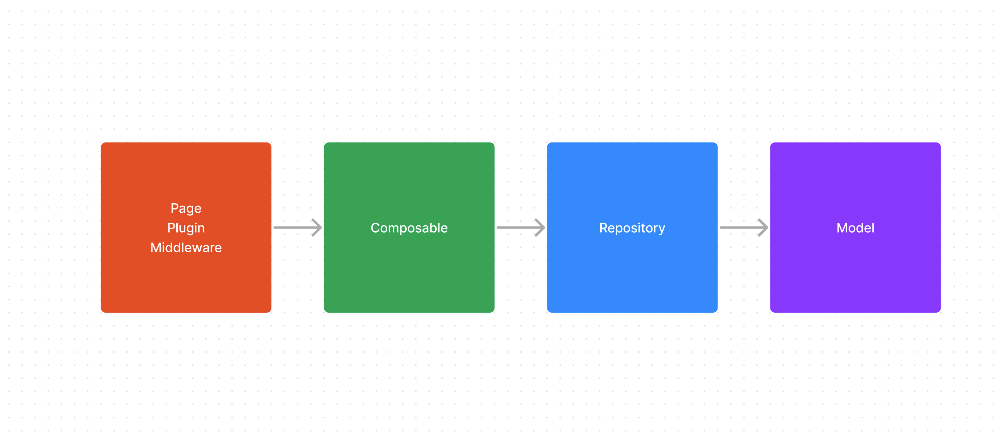

# DJ System v1

[DJ System v1](https://github.com/lit-kansai/dj-system-client-member) のアーキテクチャです。

## 使用するフレームワーク

Nuxt2 と TypeScript を使用しました。

## 全体像

特筆すべきディレクトリだけピックアップしています。
```
src/
├─ components
├─ core/
│  ├─ models
│  ├─ repository
│  ├─ composables
├─ pages
├─ plugins
```

## 依存関係


## ディレクトリ
各ディレクトリの役割についてです。

### components

コンポーネントを格納します。
コンポーネントの切り分け方には Atomic Design を採用しました。

### models

API のレスポンスを TypeScript の型に落とし込む層です。
DTO もここに書きます。

#### 命名規則

```markdown
# interface
I{model名}Model

# 実装
{model名}Model
```

### repository

API とやり取りする層です。

#### 命名規則

```markdown
# interface
I{repository名}Repository

# 実装
{repository名}Repository
```

### composables

ビジネスロジックを書く層です。

#### 命名規則

```markdown
# interface
一旦なしで大丈夫そう

# 実装
{repository名}Repository
```

## 反省点

### Atomic Design必要なかった。

今回のサービスはそれほど大規模ではないので Atomic Design を使って細かくコンポーネントを分ける必要がなかった。
抽象化しても結局使わないケースが多発しました。
Atomic Design に従うコスト>>>>恩恵だったでした。
結局抽象化しても再利用しない事だらけ&最初から予想できたものではあるので、必要が出てきた時に切り出すくらいの方がプロジェクトの初期は良さそうだなと気づきました。

### 役割ベースでディレクトリを分けてしまった

役割ベースでディレクトリを分けてしまったのが原因で 1 つのドメインに関するロジックがプロジェクトのいろいろな部分に散らばってしまった。

#### 改善案
各ディレクトリにドメインを表すサブディレクトリを生やすなどして、可読性の高いディレクトリ構成にしたかった。

```
# 現状
composables // すべてが一つの階層に格納されている
├─ moduleA
├─ moduleB
├─ moduleC
├─ moduleD

composables // どのドメインに紐づくものかをサブディレクトリを用いて示す
│  ├─ room
|  |   ├─ moduleA
│  ├─ post
|  |   ├─ moduleB
```

### Composablesの責務の肥大化
Composables に
- ドメイン単体に関するロジック
- 複数のドメインを横断するロジック
の２つのロジックが 1 つのディレクトリで管理されてしまった。

#### 改善案
- 複数のドメインを横断するロジックは usecase など別のディレクトリに切り出す。

- アプリの規模的に 1 ページの機能はシンプルなので Pages に複数のドメインを横断するロジックを実装する